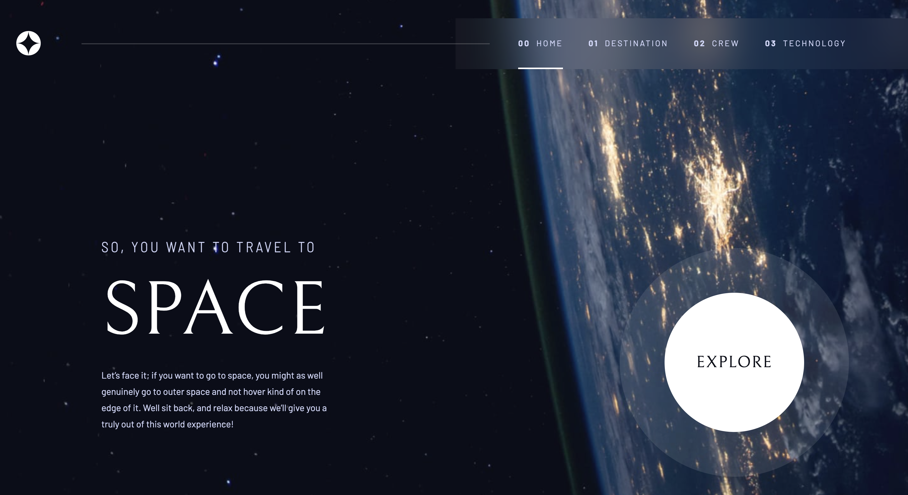

# Space Tourism

The Space Tourism Website offers users a glimpse into the future of space travel by showcasing various celestial destinations that are envisioned as potential tourist attractions. Users can navigate through the site, learn about each destination, view stunning images, and get inspired to embark on an otherworldly journey.

This is a solution to the [Space tourism website challenge on Frontend Mentor](https://www.frontendmentor.io/challenges/space-tourism-multipage-website-gRWj1URZ3). 

## Features
### Interactive Interface: 
  Engage with a visually appealing and user-friendly interface designed to provide an immersive browsing experience.
### Destination Profiles: 
  Explore detailed profiles for each space tourism destination, including descriptions, images, and key highlights.
### Responsive Design: 
  Enjoy seamless navigation across devices, from desktops to smartphones, thanks to the website's responsive layout.
### Future Updates: 
  Stay tuned for future updates and additions, as we continuously expand the selection of featured destinations and enhance the user experience.

## Technologies Used

- [React](https://reactjs.org/) - JS library
- [Styled Components](https://styled-components.com/) - For styles
- [Netlify](https://app.netlify.com/) - Hosting the live deployment of the website

### Links

- Solution: [URL](https://www.frontendmentor.io/solutions/responsive-pages-for-mobile-tablet-and-desktop-screens-B-RnzsOuMx)
- Live Site: [URL](https://space-tourism-by-zumrud.netlify.app/)

## Author

[Zumrud](http://localhost:3000/portfolio)